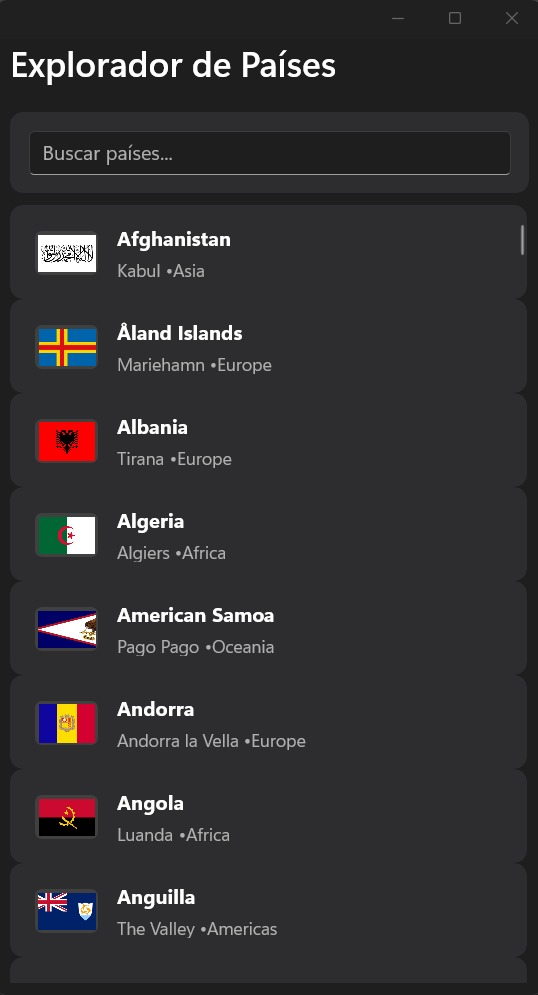
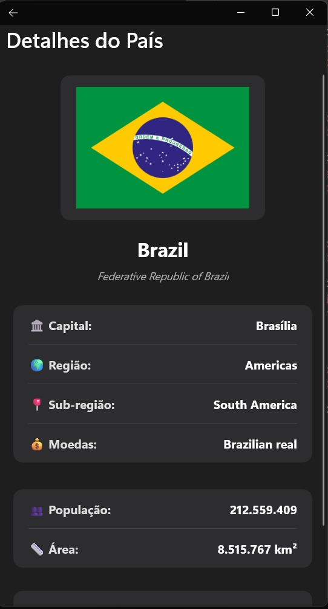
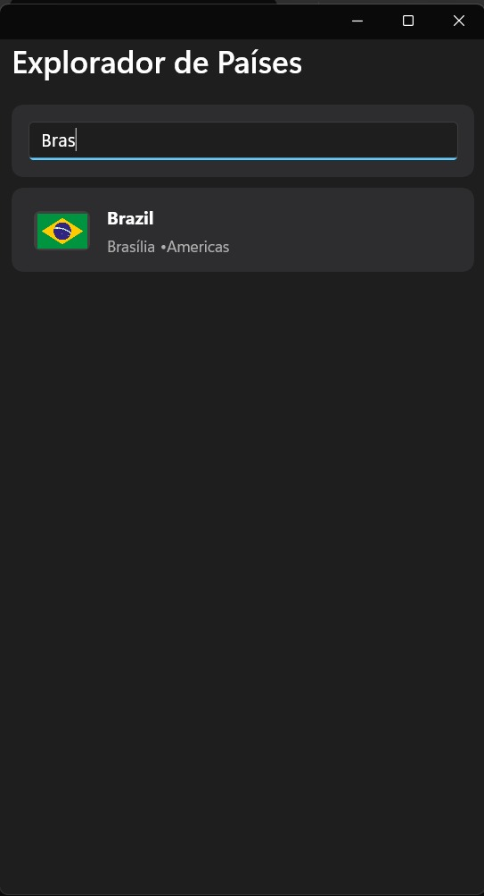

# 🌍 Explorador de Países

Uma aplicação mobile desenvolvida em .NET MAUI que permite explorar informações sobre países do mundo através do consumo da REST Countries API.

## 📱 Funcionalidades

### Tela Principal
- **Lista de Países**: Exibe todos os países com bandeira, nome comum e capital
- **Campo de Pesquisa**: Permite pesquisar países por nome em tempo real
- **Interface Intuitiva**: Lista rolável com design limpo e responsivo

### Tela de Detalhes
Ao selecionar um país, você terá acesso às seguintes informações:
- **Bandeira** (em tamanho ampliado)
- **Nome Comum e Nome Oficial**
- **Capital**
- **Região**
- **Sub-região**
- **População Total**
- **Área (km²)**
- **Moedas Utilizadas**
- **Línguas Faladas**

## 🏗️ Arquitetura

O projeto foi desenvolvido seguindo boas práticas de arquitetura de software:

### Estrutura em Camadas
```
📁 ExploradordePaises/
├── 📁 Models/
├── 📁 Services/
├── 📁 ViewModels/
```

### Padrão MVVM
- **Model**: Representação dos dados dos países
- **View**: Interfaces XAML (MainPage, DetailPage)
- **ViewModel**: Lógica de negócio e binding de dados

### Tecnologias Utilizadas
- **.NET MAUI** - Framework multiplataforma
- **REST Countries API** - Fonte de dados públicos
- **HttpClient** - Consumo da API REST
- **MVVM Pattern** - Arquitetura de apresentação
- **Data Binding** - Vinculação de dados

## 🚀 Como Executar

### Pré-requisitos
- **Windows Machine** (obrigatório)
- Visual Studio 2022 (versão 17.8 ou superior)
- Workload ".NET Multi-platform App UI development" instalado
- .NET 8.0 SDK

### Passos para Execução

1. **Clone o repositório**
   ```bash
   git clone https://github.com/Rafaele-dev/ExploradordePaises
   cd ExploradordePaises
   ```

2. **Abra o projeto**
   - Abra o arquivo `ExploradordePaises.sln` no Visual Studio 2022

3. **Restaure as dependências**
   ```bash
   dotnet restore
   ```

4. **Configure o projeto de inicialização**
   - Defina o projeto MAUI como projeto de inicialização
   - Selecione o target desejado (Windows, Android, etc.)

5. **Execute a aplicação**
   - Pressione `F5` ou clique em "Iniciar Depuração"

### Plataformas Suportadas
- ✅ Windows (WinUI)
- ✅ Android

## 📸 Screenshots

### Tela Principal

*Lista de países com campo de pesquisa*

### Tela de Detalhes

*Informações completas do país selecionado*

### Funcionalidade de Pesquisa

*Filtragem de países em tempo real*

## 🔧 Decisões de Arquitetura

### Interface do Usuário
- **Design Responsivo**: Adaptável a diferentes tamanhos de tela
- **Navegação Intuitiva**: Fluxo simples entre listagem e detalhes
- **Performance**: Lista virtualizada para grandes volumes de dados
- **Pesquisa**: Filtro em tempo real com debounce para otimização

### Padrões Implementados
- **MVVM**: Separação clara entre lógica e apresentação
- **Dependency Injection**: Injeção de dependências nativa do .NET
- **Async/Await**: Operações assíncronas para não bloquear a UI

## 🌐 API Utilizada

**REST Countries API**
- URL Base: `https://restcountries.com/v3.1/`
- Documentação: https://restcountries.com/
- Endpoints utilizados:
  - `GET /all` - Lista todos os países
  - `GET /name/{name}` - Busca por nome

## 📋 Melhorias Implementadas

Além dos requisitos originais, foram adicionadas as seguintes funcionalidades:

1. **Campo de Pesquisa**: Permite filtrar países por nome na tela principal
2. **Informações Adicionais**: 
   - Sub-região
   - População total
   - Área em km²
   - Línguas faladas
3. **Interface Aprimorada**: Design mais moderno e responsivo
4. **Performance**: Cache e otimizações para melhor experiência

---

**Observação**: Esta aplicação foi desenvolvida e testada em **Windows Machine**. Para execução em outras plataformas, podem ser necessários ajustes específicos de configuração.